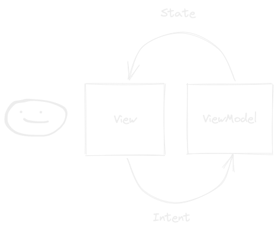

This is an example of the application using Jetpack Compose as UI rendering engine and MVI (Model View Intent) architecture for the ViewModel.

MVI is a Reactive Unidirectional Architecture Pattern which is short for Model-View-Intent
Data flows from View to the ViewModel in a form of intents. 
And from ViewModel to View in a form of States.
A state if a snapshot of the View at the moment.



[DetailsViewModel](/app/src/main/java/nyc/high/schools/viewmodel/DetailsViewModel.kt) is an example of such MVI ViewModel.

In order to achieve MVI, DetailsViewModel has 3 properties:

```kotlin
/**
 * Handles stream of intents from the view
 */
fun onIntent(intent: Intent)

/**
 * Exposes stream of states to the View
 */
val state: StateFlow<State>

/**
 * Exposes stream of side-effect, like navigation events
 */
val events: Flow<Event>

```